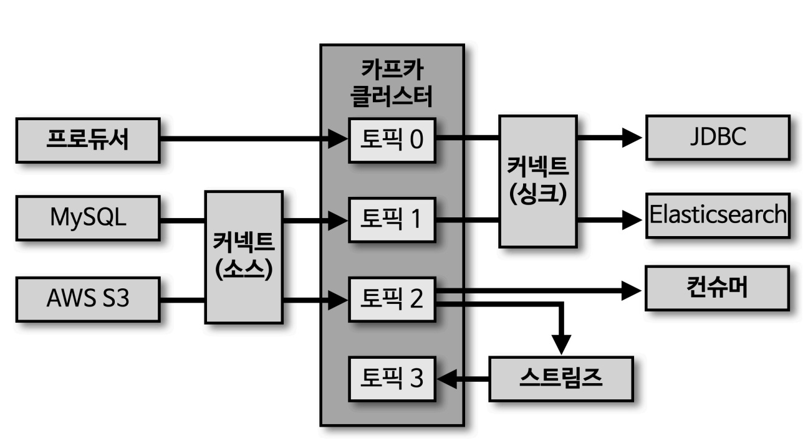
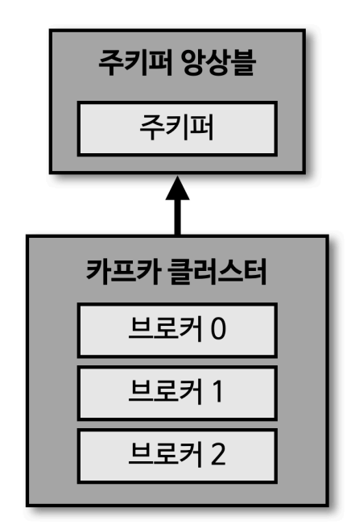
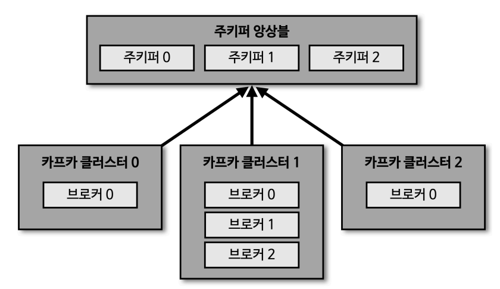
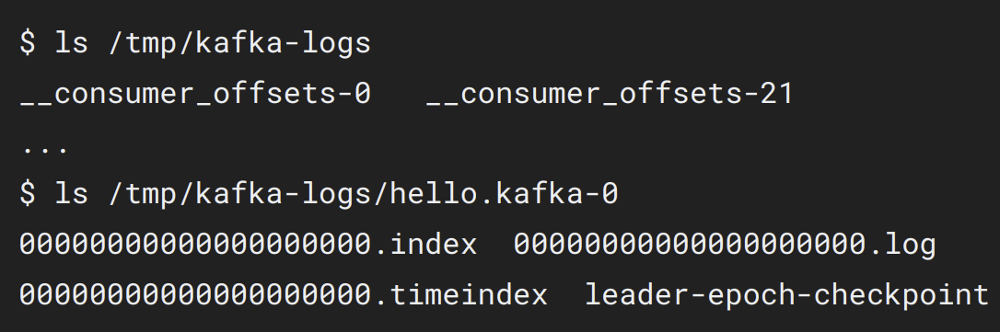

# 1. 오픈소스 아파치 카프카 생태계

* 기본적으로 카프카 클러스터가 있고, 목적에 따른 토픽들이 존재한다.
* 데이터를 넣는 역할을 하는 **'프로듀서' (Producer)**
* 데이터를 가져가는 **'컨슈머' (Consumer)**
* 토픽에 저장된 데이터를 재가공 해서 다른 토픽에 넣고 싶을 때 사용하는 **'스트림즈'**
* 원천 데이터를 가져오거나 타겟 저장소에 데이터를 저장할 떄 사용하는 **'커넥트'**
	* 소스 커넥트는 Producer 역할을 한다.
	* 싱크 커넥트는 Consumer 역할을 한다.
* Producer, Consumer, Streams, Connect 모두 카프카에서 공식적으로 오픈소스로 제공하는 java로 만들어진 라이브러리. (golang 등 다른 언어로 되어 있는 라이브러리들은 3rd party 이며, 호환성을 보장할 수 없다.)
---
# 2. 카프카 브로커와 클러스터

* 카프카 2.X 버전 까지는 주키퍼가 필수이지만, 3.X 버전 까지는 주키퍼가 필수가 아니다.
* 카프카 클러스터는 N 개의 브로커로 이루어져 있다.
	* 각 브로커는 하나의 물리적 서버 또는 인스턴스이다.
	* 보통 상용에서는 3개의 브로커를 운영한다. (많게는 50~100개까지)
* N개의 브로커는 데이터를 분산 저장하여 장애 발생시에도 안전하게 사용할 수 있도록 도와주기 때문에, 브로커는 최소 2~3개로 운영하는 것이 좋다.
---
# 3. 카프카 클러스터와 주키퍼

* 카프카 클러스터를 실행하기 위해서는 주키퍼가 필요하다.
* 여러개의 카프카 클러스트를 운영하는 경우가 있다.
	* 각 팀별로 다른 카프카 클러스터를 사용하는 경우 등.
	* 주키퍼 앙상블을 통해서 동시에 여러 카프카 클러스터를 운영할 수 있다.
		* 주키퍼 설정 시, root znode에 각 클러스터별 znode 를 생성하고, 클러스터 실행시 root 가 아닌 하위 znode 로 설정 한다.
---
# 4. 카프카 브로커의 역할

* 컨트롤러
	* 카프카 클러스터 내 N 개의 브로커 중 한대가 '컨트롤러' 역할을 한다.
	* 클러스터 내에는 리더 파티션과 팔로워 파티션이 존재하는데, 특정 브로커가 다운되면, 컨트롤러 브로커는 해당 down 된 브로커의 리더 파티션을 다른 브로커로 재분배한다.
	* 컨트롤러 브로커가 down 된 경우에는 다른 브로커가 컨트롤러 역할을 대신한다.
* 데이터 삭제
	* 카프카는 다른 메시징 플랫폼과 다르게, 컨슈머가 메시지를 소모해도 데이터가 삭제되지 않는다.
	* 카프카는 삭제를 파일 단위로 수행하는데 이 단위를 '로그 세그먼트' (log segment)라 불린다.
* 컨슈머 오프셋 저장
	* 토픽에 있는 데이터를 컨슈머가 가져갔을 때, 컨슈머는 본인이 데이터 어디까지 처리했는지를 commit 을 통해 브로커에게 알리는데, 브로커는 각 컨슈머가 어느 데이터 까지 처리했는지 offset 정보를 저장한다. 
	* commit 된 offset 데이터는 '**consumer_offsets**' 토픽에 저장된다. 카프카가 재구동 됐을때 컨슈머별로 어디까지 데이터를 처리 했는지를 확인할 수 있다.
* 그룹 코디네이터
	* 컨슈머 그룹의 상태를 체크하고 파티션을 컨슈머와 매칭되도록 분배하는 역할.
	* 특정 컨슈머가 컨슈머 그룹에서 빠지면 매칭되지 않은 파티션을 정상 동작하는 컨슈머로 할당하여 끊임 없이 데이터가 처리되도록 돕는다.
	* 컨슈머가 끊긴 파티션을 다시 살아있는 컨슈머로 재할당 하는 과정을 '**리밸런스**' 라고 한다.
* 데이터 저장
	* 카프카 실행 시, config/server.properties 의 **log.dir 옵션에 정의한 디렉토리**에 데이터를 저장한다.
		* **토픽 이름과 파티션 번호의 조합**으로 하위 디렉토리를 생성하여 데이터를 저장한다.
		* 
		* hello.kafka 토픽의 0번 파티션에 존재하는 데이터를 확인할 수 있다.
		* .log 파일 : 메시지와 메타데이터를 담은 파일.
		* .index 파일 : 메시지의 오프셋을 인덱싱한 정보를 담은 파일.
		* .timeindex 파일 : 메시지에 포함된 timestamp 값을 기준으로 인덱싱한 정보를 담은 파일.
	* 로그와 세그먼트
		* log 가저장될 때, 하나의 파일에 모두 저장되는게 아니라, 바이트 단위 or 시간 단위로 파일이 새로 생성된다. 로그파일의 단위를 세그먼트라고 말한다. 
			* log.segment.bytes : 설정값에 도달 시 새로운 파일로 생성. (기본 값은 1GB)
			* log.roll.ms(hours) : 세그먼트가 신규 생성된 이후 다음 파일로 넘어가는 시간 주기 (기본값은 7일)
	* 액티브 세그먼트
		* 쓰기가 현지 발생하고 있는 파일 (마지막 로그 파일)
		* 액티브 세그먼트는 브로커의 삭제 대상에 포함되지 않는다.
		* 액티브 세그먼트가 아닌 나머지 세그먼트는 리텐션(retention)기간 옵션에 따라 대상으로 지정된다.
	* 세그먼트 삭제 관련 설정
		* cleanup.policy=delete
			* retention.ms(minutes, hours) : 세그먼트를 보유할 최대 기간 (기본 값 7일)
				* **디스크 여유 용량을 기준으로 고려해봐야 한다.** 
			* retention.bytes : 파티션 당 로그 적재 바이트 값 (기본 값 미지정 -1)
			* log.retention.check.interval.ms : 세그먼트가 삭제 영역에 들어왔는지 확인하는 간격 (기본 값 5분)
			* 유의사항
				* 카프카 데이터는 세그먼트 단위로 삭제가 발생하기 때문에, 로그의 한줄한줄 단위(레코드)는 개별적으로 삭제가 불가능하다. 또한 이미 적재된 데이터에 대해서 레코드의 키, 메시지 값, 오프셋, 헤더 등의 데이터는 수정이 불가능하다. -> 데이터를 적재할 때나 사용할 때, 데이터를 검증하는 것이 좋다. (**뭘 어떻게 검증 ? 문제가 없는지 라니 무슨 문제 ?)
		* cleanup.policy=compact
			* 토픽을 **압축**하는 정책 (delete 는 세그먼트 단위로 **삭제** 하는 정책)
			* 한 세그먼트 내에서 메시지 키 별로 메시지 키의 레코드 중 오래된 데이터를 삭제하는 정책.
			* 압축 시에는 영역별로 다르게 수행된다.
				* 테일 영역
					* 압축 정책에 의해 압축이 완료된 레코드들(클린)이 모여있는 곳. 클린 로그 라고도 불린다.
				* 헤드 영역
					* 압축 정책이 되기 전 레코드들로, 더티(dirty)로그 라고도 불린다. 중복된 메시지 키가 있다.
		* min.cleanable.dirty.ratio 옵션
			* 엑티브 세그먼트를 제외하고, 테일 영역의 레코드 개수와 헤드 영역의 레코드 개수의 비율에 따라서 압축을 진행한다. 
			* 0.9와 같이 크게 설정하면 한번 압축을 할 때 많은 데이터가 줄어드므로, 압축 효과가 좋다. 그러니 0.9 비율이 될 때 까지 삭제가 발생하지 않으므로, 용량 효율이 좋지 않다. 
			* 반대로 0.1 과 같이 작게 설정하면 압축이 자주 일어나서, 가장 최신 데이터만 유지할 수 있지만, 압축이 자주 발생하기 때문에 브로커에 부담이 된다. 
			* **적정한 설정 값을 설정해야 한다.** 

* 복제 (Replication)
	* 